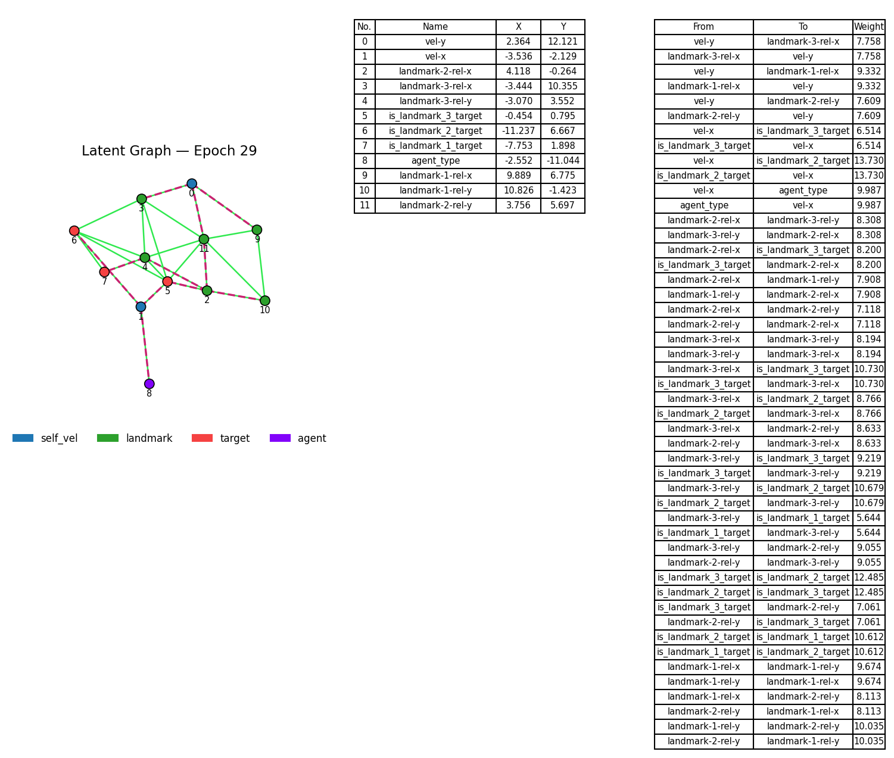

# Graph-Enchanced-Communication

## Dependecies

Install the required Python Packages by using **requirements.txt**.
 
## Graph Autoencoder

This project includes an implementation of a **Graph AutoEncoder** for encoding and reconstructing agent observations from the `simple_speaker_listener_v4` environment (from [PettingZoo](https://www.pettingzoo.ml/)). It uses a **Gabriel Graph** to build a latent graph structure and includes advanced visualization of the resulting latent space.

### Usage

Train the model and generate visualizations:
```bash
python graph-autoencoder.py [arguments]
```

### Command-Line Arguments

| Parameter                | Type    | Default Value     | Description                                         |
|--------------------------|---------|-------------------|-----------------------------------------------------|
| `input_dim`              | `int`   | `5`               | Input feature dimension for the encoder             |
| `output_dim`             | `int`   | `3`               | Output dimension of the latent embedding            |
| `hidden_dim`             | `int`   | `64`              | Hidden layer size for GAT layers and MLP            |
| `epochs`                 | `int`   | `30`              | Total number of training epochs                     |
| `lr`                     | `float` | `0.0025`          | Learning rate for the optimizer                     |
| `model_save_path`        | `str`   | `"model"`         | Directory to save the trained model                 |
| `num_samples`            | `int`   | `1024`            | Number of synthetic samples to generate             |
| `batch_size`             | `int`   | `64`              | Batch size used for training                        |
| `factor`                 | `float` | `0.5`             | Factor to reduce the learning rate                  |
| `patience`               | `int`   | `5`               | Epochs to wait before reducing LR if no improvement |
| `alpha`                  | `float` | `0.1`             | Skip connection blending coefficient                |
| `max_norm`               | `float` | `1.0`             | Max gradient norm for clipping                      |
| `gamma`                  | `float` | `0.1`             | Weighting coefficient in the loss function          |
| `is_growth_from_central` | `bool`  | `False`           | Enable calculate growth from central user           |
| `visualise`              | `bool`  | `False`           | Enable visualization of graphs per epoch            |
| `visual_save_path`       | `str`   | `results/graphic` | Directory to save graphics                          |
| `save_metrics`           | `bool`  | `False`           | Enable saving metrics of experiment per epoch       |
| `data_save_path`         | `str`   | `results/metrics` | Directory to save metrics                           |

Input feature dimension for encoder       | 
### Output Artifacts

- Model Checkpoint:
  - Saved to graph_autoencoder_YYYYMMDD_HHMMSS.pth
- Graph Visualizations:
  - Saved as graphs/epochXX.png, showing:
    - Node positions in 2D latent space 
    - Gabriel Graph edges 
    - Minimum Spanning Tree (MST)
    - Tabular node and edge summaries

Example of visualisation:
